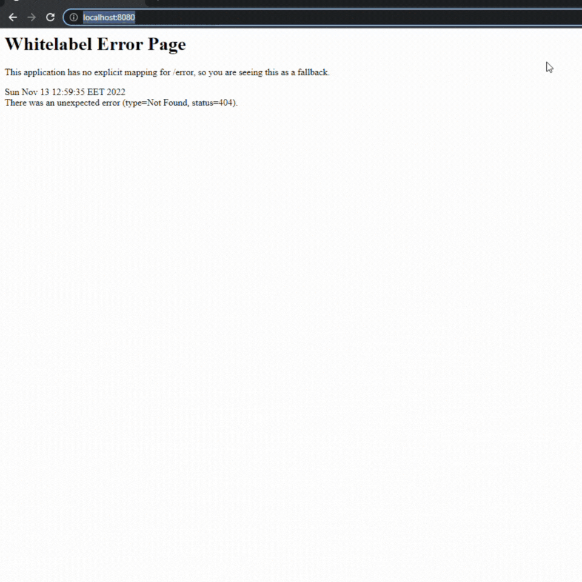

# Read Me First
The following was discovered as part of building this project:

* The original package name 'com.reactive.app.reactive app' is invalid and this project uses 'com.reactive.app.reactive.app' instead.
* This is a simple reactive web application that will emit a response. It will simulate a market data that will emit a price every second.

# Getting Started

* To start this webservice you will have to run this command `mvn clean install`.
* After the build is done successfully execute the jar: `java -jar targer/reactive-app-0.0.1-SNAPSHOT.jar`

# Checking the reactive endpoint in the browser
Once the webservice is launched and is running check the reactive endpoint in your browser by accessing this [URL](http://localhost:8080/forex/marketPrice/EURUSD)

### Reference Documentation
For further reference, please consider the following sections:

* [Official Apache Maven documentation](https://maven.apache.org/guides/index.html)
* [Spring Boot Maven Plugin Reference Guide](https://docs.spring.io/spring-boot/docs/2.7.5/maven-plugin/reference/html/)
* [Create an OCI image](https://docs.spring.io/spring-boot/docs/2.7.5/maven-plugin/reference/html/#build-image)
* [Spring Reactive Web](https://docs.spring.io/spring-boot/docs/2.7.5/reference/htmlsingle/#web.reactive)

### Guides
The following guides illustrate how to use some features concretely:

* [Building a Reactive RESTful Web Service](https://spring.io/guides/gs/reactive-rest-service/)

